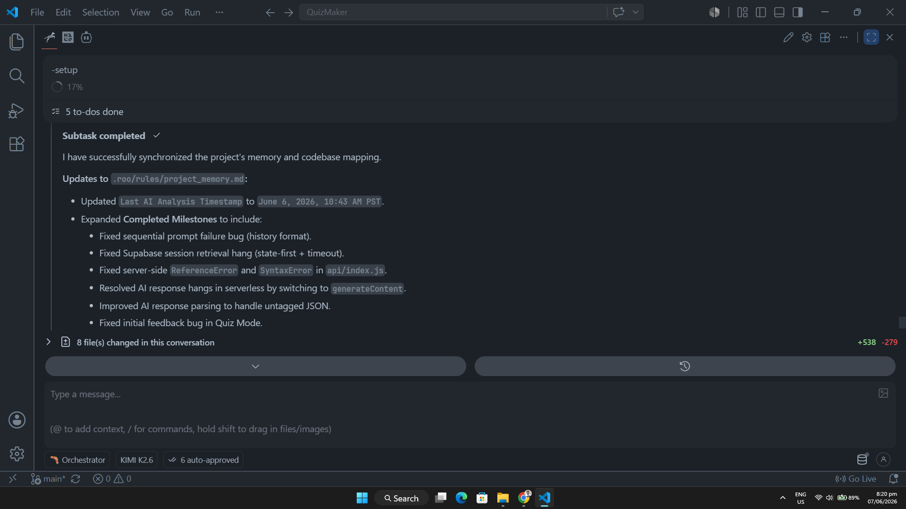
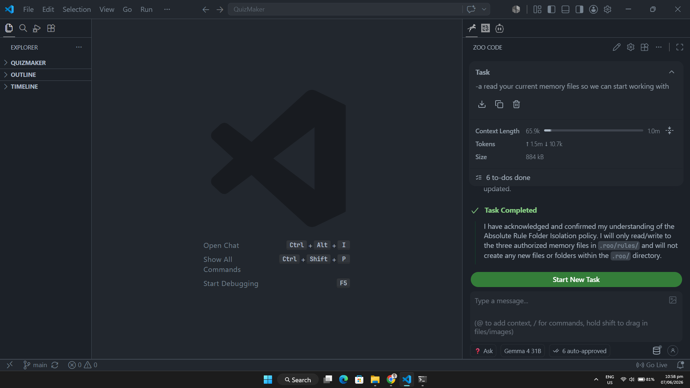
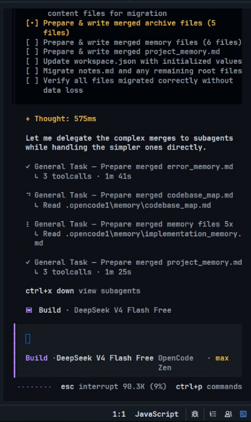
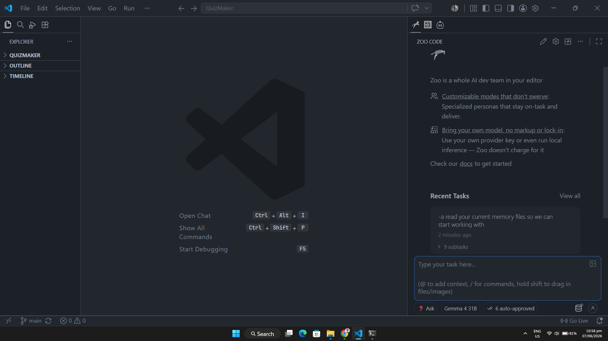

# TTV (Track The Vibe) - Workspace Template

<p align="center">
  
  
  
  
</p>

<p align="center">
  <strong>Run a whole team of industry-like personas that never forgets your codebase every session.</strong>
</p>
<p align="center">
  <strong>You lead. You learn.</strong>
</p>

---

## Quick Links

[What is this?](#what-is-this-template-for) | [Where to Use?](#you-can-use-this-template-for) | [Problem We Solve](#the-problem-we-solve) | [Memory System](#memory-system) | [Folder Structure](#folder-structure-on-opencode-template) | [Prompt Triggers](#prompt-triggers-manual-commands) | [Installation](#installation-guide) | [FAQ](#faq) | [Usages](#own-usages)

---

## Recent Updates

- Redesigned **codebase_map.md** with Frontend/Backend/Data & Platform sections with tracking IDs (FN-FE, FN-BE, DB, SVC, DEP, OPS)
- Restructured **project_memory.md** as AI-only context file — removed overlapping architecture/features, added milestone tracking, compact dash-only logging for space efficiency
- Added **subtask delegation enforcement** (`-d` / `.clinerules`) — mandatory subagent use for file reads >50 lines, codebase searches, multi-file edits, debugging traces, and test pipelines
- Added **subagent context protection** in system_instructions.md — subagents return only structured summaries, raw output stays out of main context
- Redesigned **Orchestrator** (`-o`) with 11-stage quality pipeline and built-in loops.

---

## What is this Template For?

AI coding tools forget your project fast. They read too many files, fill up context, and lose track of what they built last session.

This template adds a **memory layer** to your project. It gives the AI strict rules, specialized roles, and lightweight markdown files to track its own progress.

**Why workspace-level, not global?** Global rules mix all your projects together. Old project data leaks into new ones. Workspace rules keep each project isolated and clean.

---

## You can use this template for:

- Cline [cline.bot]
- Roo Code [roocode.com]
- Zoo Code [Zoo Code Organization] (community fork, migrating to Roomote)
- Kilo Code [kilocode.ai]
- OpenCode CLI

_(works with any AI agent that can read workspace-level rule files)_

---

## The Problem We Solve

### Key Differences

| Aspect                | Without Template            | With UVE Coding Strat      |
| :-------------------- | :-------------------------- | :------------------------- |
| **Memory**            | Lost after context reset    | Saved in markdown files    |
| **Token Usage**       | Reads entire repo each time | Only reads relevant memory |
| **AI Behavior**       | Generic, no specialization  | 8 specialized personas     |
| **Session Recovery**  | Re-explain everything       | Type `-setup` to restore   |
| **Project Isolation** | Global rules cause leaks    | Workspace-level isolation  |

---

## Memory System

Your project stores memory in simple markdown files. The AI reads them when needed.

| File                       | Purpose                               |
| :------------------------- | :------------------------------------ |
| `project_memory.md`        | Task tracker (permanent)              |
| `error_memory.md`          | Bug traces and fix history            |
| `codebase_map.md`          | File index and tech stack (permanent) |
| `implementation_memory.md` | Architecture and feature flows        |
| `security_memory.md`       | Vulnerability tracking                |
| `review_memory.md`         | Code review findings                  |
| `test_memory.md`           | Test strategies and coverage          |

When any section passes 10 entries, the oldest are moved to `archives/`.

---

## Orchestrator Workflow

| Step | Stage        | What Happens                                            |
| :--: | :----------- | :------------------------------------------------------ |
|  1   | **PLAN**     | Suggests modern tools, explains WHY, asks your approval |
|  2   | **CODE**     | Implements after you approve each tool choice           |
|  3   | **TEST**     | Runs typecheck, lint, Vitest, Playwright, coverage      |
|  4   | **DEBUG**    | Fixes failures, explains bugs in simple terms           |
|  5   | **SECURE**   | Checks OWASP Top 10, suggests security tools            |
|  6   | **DEBUG**    | Second pass for hidden or newly introduced issues       |
|  7   | **TEST**     | Second pass to verify all fixes are clean               |
|  8   | **CLEAN**    | Removes debug artifacts, suggests ESLint/Prettier       |
|  9   | **REVIEW**   | Quality check with severity ratings                     |
|  10  | **DOCUMENT** | Writes summary for your project docs or thesis          |
|  11  | **ASK**      | "Fix findings? New task? Questions?"                    |

Loops back if tests fail or security issues are found. The AI never moves to the next step without your approval.

---

## Folder Structure (on .opencode template)

```text
Your-Project-Root/
└── .opencode/                          Root configuration directory for OpenCode.
    ├── rules/                          Core behavioral rules and task tracking.
    │   ├── .clinerules                 Primary recovery ground truth during context loss.
    │   ├── system_instructions.md      System operational limitations, token management.
    │   └── project_memory.md           Master task tracker for milestones and pending items.
    ├── memory/                         Specialized memory logs separated by concern.
    │   ├── error_memory.md             LIFO-sorted tracking for active and resolved bugs.
    │   ├── codebase_map.md             File directory index, tech stack, and logic paths.
    │   ├── implementation_memory.md    Architectural design maps and feature flows.
    │   ├── security_memory.md          Vulnerability tracking and threat modeling.
    │   ├── review_memory.md            Code review findings and severity classifications.
    │   └── test_memory.md              Test strategies, coverage analysis, and case docs.
    ├── archives/                       Pre-created archive files for overflow entries.
    │   ├── error_archive.md            Receives archived entries from error_memory.md
    │   ├── implementation_archive.md   Receives archived entries from implementation_memory.md
    │   ├── security_archive.md         Receives archived entries from security_memory.md
    │   ├── review_archive.md           Receives archived entries from review_memory.md
    │   └── test_archive.md             Receives archived entries from test_memory.md
    ├── skills/                         Modular on-demand task capabilities.
    │   ├── ask/
    │   │   └── SKILL.md                Read-only persona for architecture reviews.
    │   ├── coder/
    │   │   └── SKILL.md                Engineering persona for feature implementation.
    │   ├── debugger/
    │   │   └── SKILL.md                Forensic diagnostic persona for problem tracing.
    │   ├── orchestrator/
    │   │   └── SKILL.md                High-level task manager for multi-agent coordination.
    │   ├── planner/
    │   │   └── SKILL.md                Architectural blueprint leader for requirements.
    │   ├── reviewer/
    │   │   └── SKILL.md                Quality assurance persona for code reviews.
    │   ├── secure/
    │   │   └── SKILL.md                Safety exploit evaluator for vulnerability scores.
    │   └── tester/
    │       └── SKILL.md                Test architect for strategy and case generation.
    ├── workspace.json                  Workspace identity marker and initialization state.
    ├── AGENTS.md                       Skill execution mode registry and memory references.
    └── opencode.json                   OpenCode configuration pointing to instruction files.
```

_All four templates (.clinerules, .roo, .kilo, .opencode) share the same internal structure but use their respective root folder names for path references._

---

## Prompt Triggers (Manual Commands)

Use these flag commands:

| Command / Flag | Type            | What it does                                                | Use Case                                                                                                                              |
| :------------- | :-------------- | :---------------------------------------------------------- | :------------------------------------------------------------------------------------------------------------------------------------ |
| `-setup`       | Utility         | Updates all memory files at once.                           | First prompt or new chat session.                                                                                                     |
| `-o`           | Persona/Utility | Orchestrator - manages complex tasks.                       | Multi-step plans or implementations. Use when you prompt big tasks. Click [here](#orchestrator-workflow) to see orchestrator workflow |
| `-p`           | Persona         | Planner - creates roadmaps, waits for approval.             | `-p describe your plan`                                                                                                               |
| `-c`           | Persona         | Coder - writes production code.                             | After agreeing on a plan.                                                                                                             |
| `-d`           | Persona         | Debugger - traces errors.                                   | `-d describe the error`                                                                                                               |
| `-a`           | Persona         | Ask - read-only analysis.                                   | Questions without code changes.                                                                                                       |
| `-s`           | Persona/Memory  | Security - threat modeling, safety rating (0-10).           | Check for data leaks or credential risks.                                                                                             |
| `-r`           | Persona/Memory  | Reviewer - code quality reviews (CRITICAL/HIGH/MEDIUM/LOW). | After code changes to check quality.                                                                                                  |
| `-t`           | Persona/Memory  | Tester - test strategies and coverage analysis.             | Before feature completion.                                                                                                            |
| `-clean`       | Utility         | Removes junk files and debug traces.                        | Clean up after debugging.                                                                                                             |
| `-context`     | Memory          | Updates `project_memory.md` with current workflow.          | When project context changes.                                                                                                         |
| `-error`       | Memory          | Updates `error_memory.md` with bugs and fixes.              | Every debugging session.                                                                                                              |
| `-codebase`    | Memory          | Updates `codebase_map.md` with file descriptions.           | Before deployment.                                                                                                                    |
| `-init`        | Utility         | Initializes `workspace.json`.                               | First-time setup.                                                                                                                     |
| `-archive`     | Utility         | Moves old entries to archive files.                         | When memory files get too large.                                                                                                      |

### Why Manual Triggers Instead of Auto-Updates?

The AI cannot update memory files on its own. You must type the flags manually.

- **Saves tokens and money.** Auto-updates read your entire repo on every message.
- **You control personas.** You decide when the AI switches roles.
- **Prevents hallucination.** The AI won't rewrite memory mid-task and get confused.
- **Easy session recovery.** Type `-setup` in a new chat to restore context.

---

## Installation Guide

### Step 1: Download

```bash
git clone https://github.com/worriee/clinerulestemplate.git
```

### Step 2: Pick Your Folder

| AI Tool             | Folder        |
| :------------------ | :------------ |
| Cline               | `.clinerules` |
| Roo Code / Zoo Code | `.roo`        |
| Kilo Code           | `.kilo`       |
| OpenCode            | `.opencode`   |

### Step 3: Paste Into Your Project

Copy the folder into your project root (same level as `src/` or `app/`).

```
your-project/
├── src/
├── package.json
├── .opencode/    <-- paste here
```

### Step 4: Move Root Files (Kilo and OpenCode Only)

| Tool     | Files to Move                   |
| :------- | :------------------------------ |
| OpenCode | `AGENTS.md` and `opencode.json` |
| Kilo     | `AGENTS.md` and `kilo.json`     |

These files must be in your project root, not inside the template folder.

### Step 5: Start

Type `-setup` in your AI Agent. It will read the template and learn your project.

---

## FAQ

**Q: What happens if I forget to type a memory flag manually?**
<br>The AI will still write code normally, but it won't update its internal progress tracking logs. If your chat session expires or resets, the AI won't know where you left off. Just type the correct flag (`-context`, `-error`, etc.) on your next prompt to sync it up.

**Q: Why can't the AI just update the memory files on its own every time?**
<br>Because reading and rewriting the whole memory layout on every single message uses a massive amount of tokens, which costs you more money. It also slows down the AI and makes it prone to messing up active code instructions when it gets confused during bug fixes.

**Q: Will the AI create extra folders or clutter my project?**
<br>No. A strict rule stops the AI from creating any new folders inside the template directory. It is only allowed to read and edit the existing memory files within the designated `memory/` folder.

**Q: I am starting a completely new chat session. What do I type first?**
<br>Type `-setup`. This tells the AI to read the local memory logs immediately so it gets the exact context of your project without you having to re-explain everything.

**Q: I use OpenRouter free models and the AI keeps forgetting things mid-chat. Is this normal?**
<br>Yes, free or smaller API models often have smaller context limits or weaker memory retention. If the AI starts acting lost or forgets instructions, just run `-setup` again in a fresh prompt to force-reload its brain with your project context.

**Q: What if I have a huge project plan or database design map? Where should the AI save it?**
<br>Don't let the AI make random markdown files on your root directory. It is strictly instructed to log all architectural roadmaps, system flows, and complex feature plans inside `.opencode/memory/implementation_memory.md` using the standardized flow format.

**Q: Can I mix persona flags with memory flags in the same prompt?**
<br>Yes! If you want the AI to analyze a bug and update your logs simultaneously, you can type something like `-d here is the error trace, please fix it and run -error`. The AI will adopt the Debugger mindset and update your error memory file at the same time.

**Q: Do I need to copy the configuration folder into every single project workspace?**
<br>Yes. This configuration runs on a workspace level instead of global rules. This guarantees that your different projects don't leak context, history, or code descriptions into each other.

**Q: What should I do if the AI keeps hallucinating old errors that I already fixed?**
<br>Make sure to run the `-error` command regularly when debugging. The template forces the AI to look at historical resolved bugs inside `error_memory.md` so it remembers exactly how they were handled and won't try to reuse old broken logic.

**Q: Can I use this setup with VS Code or other platforms like Antigravity or Opencode CLI?**
<br>Yes it works even in different platforms as long as you can make the AI agent look or read to this specific folder. It won't have the same automated behavior if your AI agent doesn't have the ability to look for workspace-level rule files.

**Q: What is the difference between `project_memory.md` and the files in the `memory/` folder?**
<br>`project_memory.md` is your task tracker — it only holds active tasks, completed milestones, and pending items. All specialized logs (errors, security vulnerabilities, code reviews, test strategies, implementation flows, and codebase maps) live in separate files inside the `memory/` folder to keep concerns isolated and prevent any single file from becoming too large.

**Q: How do the Reviewer (`-r`) and Tester (`-t`) personas work with the memory system?**
<br>When you use `-r` or `-t`, the AI adopts the respective persona and performs its analysis. If you also include `-setup` or explicitly request logging, the findings are saved to `.opencode/memory/review_memory.md` or `.opencode/memory/test_memory.md` using the strict LIFO format with severity classifications and structured output templates.

**Q: What happens when a memory file has too many entries?**
<br>The archive protocol activates when any section exceeds 10 entries. The AI counts entries, extracts the oldest ones (bottom entries since LIFO places newest on top), creates an archive file in `.opencode/archives/` with a timestamped filename, and retains only the 10 most recent entries in the active section. This prevents context bloat while preserving complete history.

**Q: What is the `workspace.json` file for and do I need to configure it?**
<br>`workspace.json` is the workspace identity marker. On first use, the AI detects it says `"uninitialized"`, prompts you for a project name, and writes the initialized values. After that, it prevents re-initialization conflicts. You don't need to edit it manually — the AI handles it during `-setup`.

**Q: Can I use the Reviewer and Tester personas without saving logs to memory files?**
<br>Yes. The `-r` and `-t` personas work in read-only advisory mode by default. They only write to memory files when you explicitly include `-setup` in the prompt or directly request logging. This gives you full control over what gets persisted.

---

## Own Usages

<p align="center">
    
    
    
    
    
    
    
</p>
